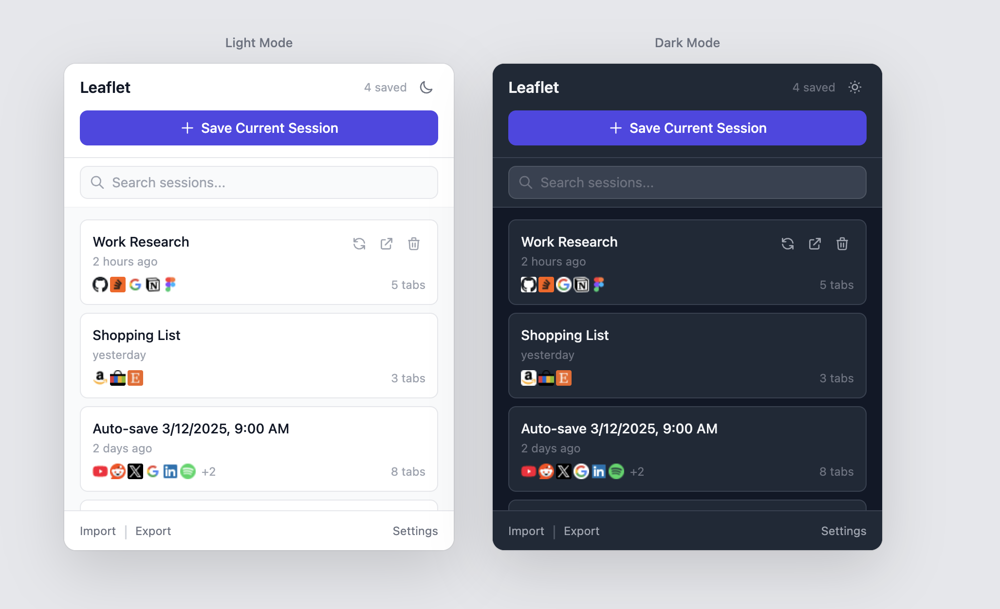
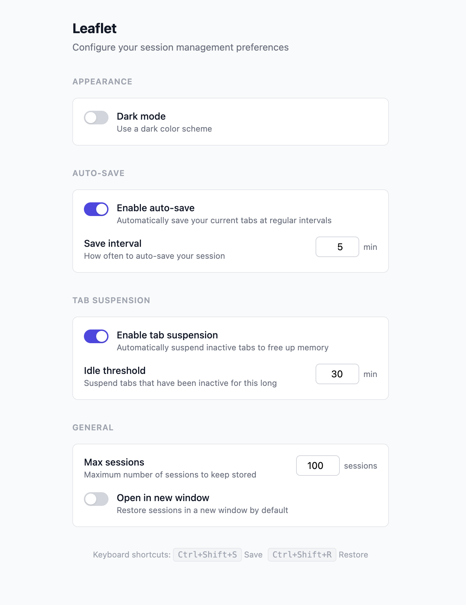

<p align="center">
  
</p>

<h1 align="center">Leaflet</h1>

<p align="center">
  <strong>Save, restore, and manage your browser tab sessions with one click.</strong>
</p>

<p align="center">
  <a href="#features">Features</a> &bull;
  <a href="#installation">Installation</a> &bull;
  <a href="#usage">Usage</a> &bull;
  <a href="#development">Development</a> &bull;
  <a href="#architecture">Architecture</a> &bull;
  <a href="#privacy">Privacy</a> &bull;
  <a href="#license">License</a>
</p>

---

<p align="center">
  
</p>

## Why Leaflet?

Ever lose a carefully curated set of tabs? Leaflet captures your entire browser window in one click and lets you restore it exactly as it was — pinned tabs, favicons, and all. It works offline, stores everything locally, and respects your privacy.

## Features

| Feature | Description |
|---------|-------------|
| **One-click save** | Capture all open tabs in your current window instantly |
| **Flexible restore** | Reopen sessions in the current window or a new one |
| **Smart search** | Filter sessions by name, tab title, or URL |
| **Auto-save** | Automatically back up your tabs at a configurable interval |
| **Tab suspension** | Free up memory by discarding inactive tabs after an idle threshold |
| **Keyboard shortcuts** | `Ctrl+Shift+S` / `Cmd+Shift+S` to save, `Ctrl+Shift+R` / `Cmd+Shift+R` to restore |
| **Export / Import** | Back up sessions as JSON and restore them on any machine |
| **Inline rename** | Double-click any session name to edit it in place |
| **Favicon previews** | See tab icons at a glance on each session card |
| **Tab count badge** | Live tab count displayed on the extension icon |
| **Dark mode** | Toggle between light and dark themes |

## Installation

### From source (developer mode)

```bash
git clone https://github.com/RiceSouffle/tab-session-manager.git
cd tab-session-manager
npm install
npm run build
```

Then load in Chrome:

1. Navigate to `chrome://extensions`
2. Enable **Developer Mode** (top-right toggle)
3. Click **Load unpacked**
4. Select the `.output/chrome-mv3` folder


## Usage

### Saving a session

Click the Leaflet icon in your toolbar, then press **Save Current Session**. All tabs in the current window are captured with their titles, URLs, favicons, and pinned state.

### Restoring a session

Hover over a saved session to reveal action buttons:

- **Restore (current window)** — opens all tabs in your current window
- **Restore (new window)** — opens all tabs in a fresh window

### Managing sessions

- **Search** — type in the search bar to filter by session name, tab title, or URL
- **Rename** — double-click a session name to edit it inline
- **Delete** — click the trash icon, then confirm

### Settings

<p align="center">
  
</p>

Click **Settings** in the popup footer to configure:

- **Auto-save** — enable and set the save interval (1–60 minutes)
- **Tab suspension** — automatically discard tabs idle for a set duration (5–120 minutes)
- **Max sessions** — limit stored sessions (10–500)
- **Default restore behavior** — open in current or new window
- **Dark mode** — toggle light/dark theme

### Keyboard shortcuts

| Shortcut | Action |
|----------|--------|
| `Ctrl+Shift+S` / `Cmd+Shift+S` | Save current session |
| `Ctrl+Shift+R` / `Cmd+Shift+R` | Restore most recent session |

> Customize shortcuts at `chrome://extensions/shortcuts`

### Export & Import

Use the **Import** / **Export** buttons in the popup footer to back up your sessions as a JSON file or transfer them between machines.

## Development

### Prerequisites

- [Node.js](https://nodejs.org/) 18+
- npm

### Setup

```bash
npm install
npm run dev
```

This launches WXT in development mode with hot reload. Load the extension from `.output/chrome-mv3-dev` in Chrome.

### Scripts

| Command | Description |
|---------|-------------|
| `npm run dev` | Start dev server with hot reload |
| `npm run build` | Production build |
| `npm run zip` | Package as `.zip` for Chrome Web Store |
| `npm run compile` | Type-check without emitting |

## Architecture

```
├── assets/              # Global CSS (Tailwind entry point)
├── components/          # Reusable React components
│   ├── ConfirmDialog    # Deletion confirmation overlay
│   ├── EmptyState       # Placeholder when no sessions exist
│   ├── ImportExport     # JSON import/export buttons
│   ├── SaveButton       # One-click save with feedback
│   ├── SearchBar        # Session filter input
│   ├── SessionCard      # Individual session display
│   ├── SessionList      # Scrollable session list
│   └── TabFavicons      # Favicon strip preview
├── hooks/               # Custom React hooks
│   ├── useDarkMode      # Theme toggle + persistence
│   ├── useSearch        # Client-side session filtering
│   ├── useSessions      # Session CRUD operations
│   └── useSettings      # User preferences
├── lib/                 # Core logic (framework-agnostic)
│   ├── badge            # Extension icon badge
│   ├── constants        # Defaults and alarm names
│   ├── sessions         # Session CRUD
│   ├── storage          # Typed chrome.storage wrappers
│   ├── suspension       # Inactive tab discard logic
│   ├── tabs             # Tab capture and restore
│   └── types            # TypeScript interfaces
├── entrypoints/
│   ├── background.ts    # Service worker (alarms, shortcuts, badge)
│   ├── popup/           # Browser action popup (React)
│   └── options/         # Settings page (React)
└── public/icon/         # Extension icons (SVG + PNG)
```

### Tech stack

- **[WXT](https://wxt.dev)** — Chrome extension framework with Manifest V3 and hot reload
- **React 19** — UI for popup and options page
- **TypeScript** — End-to-end type safety
- **Tailwind CSS 3** — Utility-first styling with dark mode
- **Chrome Storage API** — `local` for sessions, `sync` for settings

### Design decisions

- **No external dependencies for core logic** — all session management, storage, and tab operations use Chrome APIs directly
- **Separated UI hooks from storage layer** — hooks in `/hooks` consume typed wrappers in `/lib`, keeping components thin
- **Service worker is event-driven** — all listeners registered at the top level for Manifest V3 compatibility
- **Settings sync across devices** — user preferences use `chrome.storage.sync` so they follow your Google account

## Privacy

Leaflet stores all data locally on your device. It makes **zero network requests** — no analytics, no telemetry, no ads. See the full [Privacy Policy](PRIVACY.md).

## Contributing

1. Fork the repository
2. Create a feature branch (`git checkout -b feature/my-feature`)
3. Commit your changes (`git commit -m 'Add my feature'`)
4. Push to the branch (`git push origin feature/my-feature`)
5. Open a Pull Request

## License

[MIT](LICENSE) — free for personal and commercial use.
